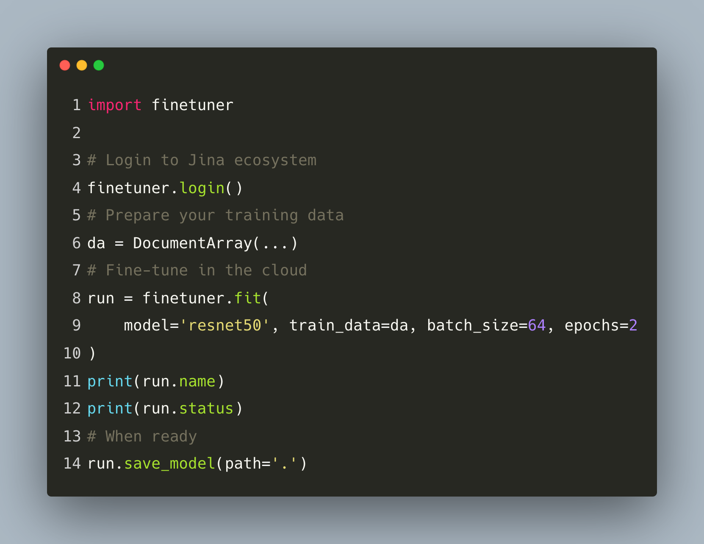

Title: Our Journet Towards Build Model Finetuning as Service For Search
Date: 2021-05-28 21:37
Tags: representation learning, finetuner
Category: thoughts
Authors: Bo Wang
Summary: Model finetuning as a service.

## Background

Deep learning for Information Retrieval is non-trivial.
Most of the people who have a background in Information Retrieval in industry lack of proper deep learning knowledge.
On the other hand, people research deep learning care a lot about classification, segmentation rather than search.

On the other hand, in the real-world,
there is a urgent need for deep learning powered search.
This is especially the case for Content-based Image Retrieval (CBIR, i.e. find similar images)
or Multi/Cross-modal Information Retrieval, even Cross-lingual Information Retrieval.

In practice, traditional search algorithms such as Okapi-Bm25 already did a good job in text-to-text search,
incorporating dense vectors for search result re-ranking (2nd-stage ranking) has been proved to bring much better search quality.
This blog explains how [Google brings Bert model into Google search](https://blog.google/products/search/search-language-understanding-bert/).

For CBIR, the "old" ways is to enable bag of visual words and in the recent years,
we use deep neural networks to extract visual representation and find similar images using similarity/distance metrics.

Most of the web shops consider each item as a **Product** rather than a single image or a piece of text descriptor.
In this case, combining image features and text features to leverage multi-modality representation becomes an essential topic.

Besides these common use cases, cross-lingual retrieval over different marketplace,
short-video retrieval, music retrieval forms several niche market.

Each of these search applications, is powered by a research community.
This research community train big models on a general task.
But bring this model to your production environment could be painful:
You'll soon realize leveraging pre-trained model produce trash search results.

Why? In research people name it **distribution shift**.
The model trained on the dataset, let's say [ImageNet](https://www.image-net.org/),
contains millions of images of real-world objects,
rather than the data within your niche market.
So we need to fine-tune this model a bit to adopt the data distribution of your dataset.

You might ask,
okay, i know there are a bunch of frameworks/services already exist, and they can help me fine-tune a model,
why you build Finetuner and turn it into a service?

## What's the difference between Finetuner and other Libraries?

Once there was a Jina AI community member ask a question:

> What's the difference between Fientuner and Huggingface Transformers Trainer and other frameworks?

I believe the major difference is we a producing an **embedding model**.
This is because for search tasks,
the most important thing is the quality of **embedding/vector/representation**.

For most of the frameworks, such as Huggingface transformers,
fine-tuning means applies transfer learning with a new **head**.
This **head** is, your task of interest.
More specifically, if you take a pre-trained VisionTransformer on ImageNet,
and want to fine-tune it for, let's say, cat-dog classification.
You **head** will becomes a 2-class classification head, rather than 1000 class ImageNet head.

Finetuner, however, **respect your choice of model**.
It could be a vision model from [timm](https://github.com/rwightman/pytorch-image-models),
[torchvision](https://github.com/pytorch/vision), or [transformers](https://github.com/huggingface/transformers).
When receiving your model of choice, Finetuner will try to interpret your model architecture and "cut" your model **head**
or applying pooling,
then convert your model into an **embedding model**.
This model, receiving an input, produce a feature vector to represent your data.
Finetuner try to learn the **data distribution** of your data and improve the quality of the learned **embedding/vector/representation**.

If you want to know more about how Fituner works in general,
please refer to my previous [blog](metric-vs-ssl.md).

## Why Finetuner becomes a service and How did we make the change?

Several important reasons,
the most important one is,
Finetuner-Service will become a stakeholder to power several Jina applications internally,
such as DocsQA, Now, Clip-As-Service and some unannounced project.

These applications do not have to care about the usage,
Finetuner will hide the complexity of machine learning,
and these applications deliver better search results to the user.

However, we would also release the service externally to help Jina users improve their search quality.
Our design objective is:

1. We care about model performance, but we're not chasing SOTA. We try to find a balance point between performance and stability.
2. User stay inside Jina ecosystem, `docarray` is the entrypoint for preparing training data.
3. Minimum configuration required, while allow user to control their experiments.

Previously, the Finetuner team within Jina is maintaining a single repo Finetuner.
This OSS version will be abandoned,
given a small team, in the past 3.5 months, this is what we have now:

1. A much improved (close sourced) Finetuner-Core, with transformer support, CLIP support, much faster training on a single GPU or across multi-gpus, bug fixes and refactoring.
2. A brand-new (close sourced) Finetuner-API, handles all cloud jobs, resource management, Finetune-job submission and deep integration with Jina's user system.
3. A brand-new (open sourced) Finetuner-Client, allow user to create configurations and talk with Finetuner-API.

In short, the heavy job has been delegrated to Finetuner-API and Finetuner-Core,
and user only need to talk with Finetuner-Client.

## How easy it is?

Please check the screenshot below:

*Note, it's not yet published to Pypi.*

Not bad, right?
Actually, user only need to provide a `model` name and `train_data`.

Once you logged in,
Finetuner will push your data to your own artifact storage (only visible to you),
reserve cloud resources such as CPU/GPU/Memory, start the job and push fine-tuned model, again,
to your artifact storage.
Once training is over, you can call `save_model` to pull your model back to your machine.
That's it!

## How much performance Gain You Can Expect?

It depends on a lot of factors.
Internally we have conducted a lot of experiments on varies tasks,
such as image-to-image search, text-to-text search, cross-modal search.
Across these three tasks, Finetuner is able to boost 20%-45% of precision@k and recall@k.
You can also observe significant performance improvement on other metrics,
such as mean recipal rank (mRR) or normalized discounted cumulative gain (nDCG).

That's it for today, thanks for your time, and we expect you get your feedback.

