Title: Before building a Neural Search Application, Build your Mind Map first
Date: 2021-03-29 20:55
Tags: information retrieval
Category: thoughts
Authors: Bo Wang
Summary: design first, implementation second

Recently when answering questions from [Jina](https://github.com/jina-ai/jina) community users,
I found a lot of developers want to build something fancy, for example:

1. build a cross-modal search system, use text to search image without labeled data.
2. build a cross-lingual search system, use Dutch to search products list in German markets.
3. build a multi-modal search system, where query could be multi-modality, such as user **Query** contains a piece of text plus image and **Documents** are products which are semi-structured texts and images.

While they're not sure about what they can do and what Jina can offer.
As someone actively working for Jina and using Jina to build solutions,
my first suggestion is:

**Before building a Neural Search Application, Build your Mind Map first**.

In the programming/software engineering world,
you might always been told to "get your hands dirty".
This could be true in a lot of domains,
but not for neural search.

Building a traditional search system using Solr/Elasticsearch is intuitive:

1. You know your input: text queries.
2. You (don't have to)know what the "analyzers" will do: such as *tokenize*, *stemming*, *lemmatization*.
3. You (don't have to)know what the "algorithm" will do: such as penalize the score of frequent tokens will assign higher scores to rare tokens.
4. You 100% percent know that if there is a document **match** your **Query**, it will appear in your ranking list.

Essentially, algorithms behind Solr/Elastic such as tf-idf, okapi bm25 are some form of advanced **boolean retrieval**.

However, for neural search, it's another story.

1. Your **Query** could be complicated: text, image, video, DNA sequence, or combination of different forms.
2. Given the fact of the **Query** and **Documents** could be uni-modal, or multi-modal, we can hardly provide a standard set of *analyzers*, such as what [Lucene can offer](https://lucene.apache.org/core/4_0_0/analyzers-common/org/apache/lucene/analysis/en/package-summary.html).
3. The deep learning model is picky. For instance, you have to carefully switch image `channel_axis` to match the library you're using. Or you have to carefully `collate` your tokens before feeding it into the model.
4. The deep learning model is fragile. Pre-trained model could hardly bring quality results in your business domain.
5. Similarity matching is time-consuming. Imaging compute cosine similarity using 1 **Query** against 1 million **Documents** (products) and keep in mind, your're building a search application. User expect to get the result in seconds.

Then it becomes tricky to manage this level of complexity.

How easy it is to delegate this complexity to Jina?
Years ago I spend around 15 minutes to learn the syntax of Markdown, it is as easy as Markdown.

Let's say, you want to build a search application (this is a real use-case) that:

1. receive 3 categories of dataset: finance, HR and sales.
2. process them separately.
3. indexing them separately.
4. search across three indices and aggregate best matches to the user.

The **Documents** might look like this:

```python
from docarray import Document, DocumentArray

da = DocumentArray()
da.append(Document(content='this is a finance document', tags={'category': 'finance'}))
da.append(Document(content='this is a HR document', tags={'category': 'hr'}))
da.append(Document(content='this is a sales document', tags={'category': 'sales'}))
# ... you have much more
```

# The naive approach

In the first iteration,
I'll do it naively.
I set up 3 `Flows`,
`Flows` first filter the `Documents` based on their category,
then employ a dedicated `Processor` to pre-processing the filtered data based on the `category`.
Afterwards, use a common `Indexer`.
The `Indexer` takes a `connection_str` as parameter to save embeddings to different vector databases.
To this end, deploy 3 Flows as 3 K8s deployments,
collect results from 3 micro-services and aggregate the final ranking results.

Sounds not bad:

```python
from jina import Flow, Executor

flow_finance = (
    Flow().add(name='finance_data_filter', uses_with={'category': 'finance'})
          .add(name='finance_data_processor')
          .add(name='finance_data_indexer', uses_with={'connection_str': 'my-host-to-finance-db:port@user/password'})
)
flow_hr = (
    Flow().add(name='hr_data_filter', uses_with={'category': 'hr'})
          .add(name='hr_data_processor')
          .add(name='hr_data_indexer', uses_with={'connection_str': 'my-host-to-hr-db:port@user/password'})
)
flow_sales = (
    Flow().add(name='sales_data_filter', uses_with={'category': 'sales'})
          .add(name='sales_data_processor')
          .add(name='sales_data_indexer', uses_with={'connection_str': 'my-host-to-sales-db:port@user/password'})
)
```

if you call ``flow_finance.plot()`` you'll get:



You'll get the same thing when calling `flow_hr.plot()` or `flow_sales.plot()`, the only difference is the naming.
Is it working? Yes! But not elegant.

One important concept you can get from a `Flow` and you might miss is the idea of `pathway`. Let's do it better!

# The Better Approach

A `pathway` is something not an official concept in Jina, but widely used to compose a multi-modal application.
Imaging your are building a multi-modal search application with both Image and Text, then you can split your `Flow`
into 2 `pathways`: one for Image and one for Text.
It is the same idea here:

We use the `Filter` 3 times  and allow dedicated `Processsors` follow the `pathway` of each `Filter`.

```python
from jina import Flow, Executor

flow = (
    Flow().add(name='finance_data_filter', uses_with={'category': 'finance'})
          .add(name='hr_data_filter', uses_with={'category': 'finance'}, needs=['gateway'])
          .add(name='sales_data_filter', uses_with={'category': 'finance'}, needs=['gateway'])
          .add(name='finance_data_processor', needs=['finance_data_filter'])
          .add(name='hr_data_processor', needs=['hr_data_filter'])
          .add(name='sales_data_processor', needs=['sales_data_processor'])
          .add(name='finance_data_indexer', uses_with={'connection_str': 'my-host-to-finance-db:port@user/password'}, needs=['finance_data_processor'])
          .add(name='hr_data_indexer', uses_with={'connection_str': 'my-host-to-hr-db:port@user/password'}, needs=['hr_data_processor'])
          .add(name='sales_data_indexer', uses_with={'connection_str': 'my-host-to-sales-db:port@user/password'}, needs=['sales_data_processor'])
          .add(name='gather_all', needs=['finance_data_indexer', 'hr_data_indexer', 'sales_data_indexer'])
)
flow.plot()
```

As you can see in the above code, rather than creating the `Flow` 3 times, we follow the idea if `pathway`.
The key is the argument `needs`: it defines which `pathway` should I follow.
For example: the `hr_data_processor` process filtered HR data, so `needs=['hr_data_filter']`.
`needs` could be either a sinlge string, or a list of string.
The last `gather_all` endpoints waits for all 3 `indexers` finish then produce the final ranking list.

> **_NOTE:_**  The default `needs` is always the previous Executor. The starting and ending point are always the `gateway`. 

The `flow` looks like this:



# The Fancy Approach

It is always interesting to explore the [Jina documentation](https://docs.jina.ai/).
If you do so you might figure out something called [Flow switches](https://docs.jina.ai/how-to/flow-switch/#how-to-build-switches-in-a-flow).
It allows you to **conditionally filter data based on your needs**.

In our previous example, `finance_data_processor` works only if the `Document` category is `finance`,
this also applies to `hr_data_filter` and `sales_data_filter`.
Lucky, you can use the `when` semantic in the `Flow` to filter the data conditional:

```python
from jina import Flow, Executor

flow = (
    Flow().add(name='finance_data_processor', when={'tags__category': {'$eq': 'finance'}})
          .add(name='hr_data_processor', when={'tags__category': {'$eq': 'hr'}}, needs=['gateway'])
          .add(name='sales_data_processor', when={'tags__category': {'$eq': 'sales'}}, needs=['gateway'])
          .add(name='finance_data_indexer', uses_with={'connection_str': 'my-host-to-finance-db:port@user/password'}, needs=['finance_data_processor'])
          .add(name='hr_data_indexer', uses_with={'connection_str': 'my-host-to-hr-db:port@user/password'}, needs=['hr_data_processor'])
          .add(name='sales_data_indexer', uses_with={'connection_str': 'my-host-to-sales-db:port@user/password'}, needs=['sales_data_processor'])
          .add(name='gather_all', needs=['finance_data_indexer', 'hr_data_indexer', 'sales_data_indexer'])
)
flow.plot()
```

Once we applied `when` argument here, the `Executor` will only applies if the condition is meet.
For instance, `hr_data_processor` only works if the `category` of `Document.tags['category']==hr`.
Think about how much this feature will bring you, imaging you only want to do some processing when some product price is greater than 500 euro,
then you can simply apply this executor with `when={'tags__price': {'$gt': 500}}`.



# Final Words

Building a neural search application is not easy,
but it brings a lot of values and open tremendous opportunities to your business.
Before getting your hands dirty,
I strongly suggest use your favourite tool to design your mind map,
such as what is your system input, output, what are the necessary building blocks.

In the above examples, you noticed i only defined the `Flow` , it's `Executors` and the relationship between `Flows`.
Once you believe this is the best design, you could start to start the real coding. i.e. implement the code behind each `Executors`.

Last but not least, I want to share a "mind map" I designed for a real-world user for multi-modal fashion product search.
That's it for today.
