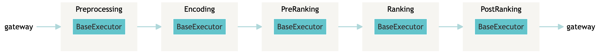
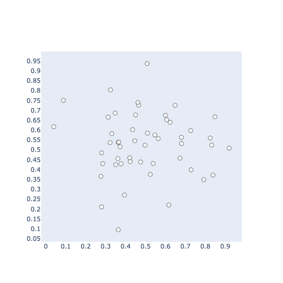
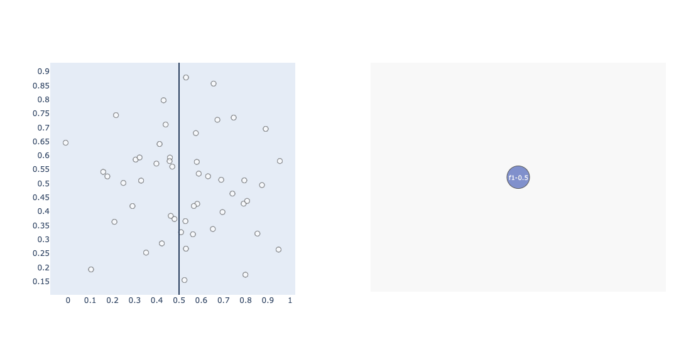
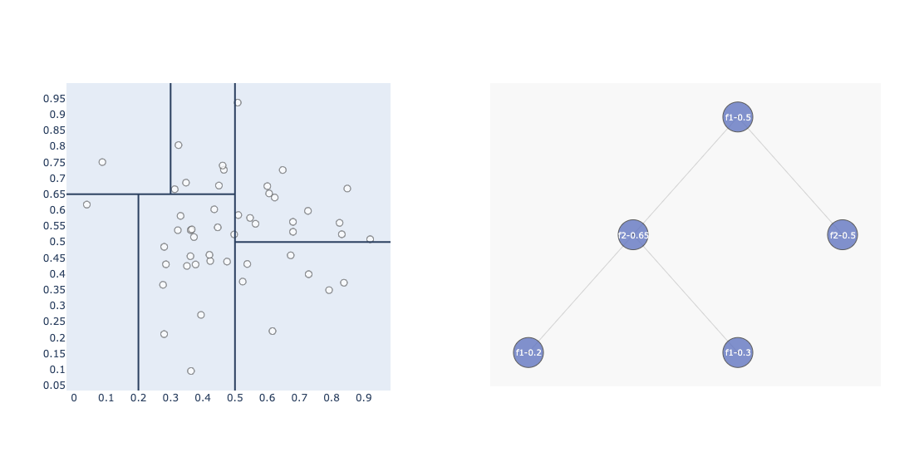
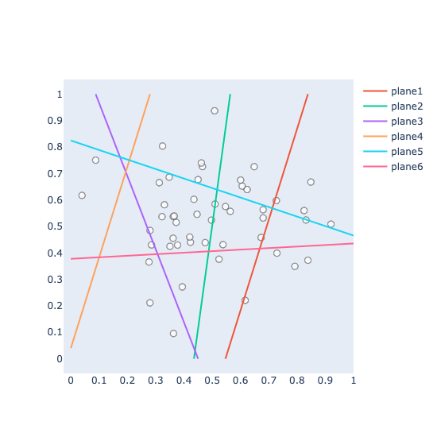

Title: Nearest Neighbour Search for Document Retrieval - 1
Date: 2022-08-14 16:48
Tags: nearest neighbour search
Category: knowledge
Authors: Bo Wang
Summary: Nearest Neighbour Search for Document Retrieval: the fundamentals

Nowadays, the Neural Search community leverages FAISS/HNSWLIB for approximate nearest neighbor search, we refer it as *ANN*.
While building a Neural Search system, *ANN* search is essential to quickly find a set of articles given millions or articles being indexed in memory or disk. The objective for *ANN* is to maximize *Recall*. Normally, we call it *Pre-Ranking*:

For those who is building a Neural Search/Recommender system, the above illustratation might looks familar to you.
After preprocessing the articles and encode all the articles into embeddings, we normally have 3 stages of Ranking:

1. *Pre-Ranking*: Leverage ANN to find candidate documents from the collections, optimize for recall (in dense-retrieval community refer it as bi-encoder).
2. *Ranking*: Given data such as pairs of documents and their similary score as label produced by pre-ranking step, leverage siamese nets/two-tower nets to optimize rank hinge loss and produce a similary score (in dense retrieval community refer it as cross-encoder).
3. *Post-Ranking*: Other ranking mearesures given by business requirements or other metrics. Such as business owners like to put articles with higher stock rate on top of the rank list, or sacrifice the precision/recall to optimize for artical diversity.

The Nearest Neighbour Search (NN) stays at the core of the pipeline: the quality of the final ranking list hightly dependent on the candidates being generated by the Pre-Ranking step. In this blog, I'm going to cover the some basic NN methods for Neural Search.

I'm going to start from KNN, then goes to KD-Trees and fianlzing with Locality Sensitive Hashing (LSH).

## Motivation

Imaging we want to build a CBIR (content-based information retrieval) system for a fashion store, which allow user to upload an image of a fashion product to find similar products in stock.

*How can we achieve that?*

At indexing time (off-line), we need to index all vision features (could be dense vectors or bag of visual words) as feature vectors. At searching time (on-line), when user post a image to the search system, we encode the query image into it's feature vector and find similar products by compute similary/distance scores between query vector and all fashion products.

*How can we achieve it fast?*

When your fashion company has limited products, it is doable using brute force search (compute score one-by-one) and produce the final rank list.
What if you have a million products or even more?
We'll answer the question in the following sub-sections.

*Problem Definition*

Given a query document $Q$ and indexed documents $D_1, D_2, ..., D_N$, we want to find top-k documents which is sorted based on similarity mearesure:

$$D^{knn} = \max_{D_i}sim(Q, D_i)$$

where $D^{knn}$ denotes for top-k nearest neightbours, and $D_i$ denotes for any documents inside the document collection.

## KNN

K-nearest neighbour is easy, we:

1. first take out $K$ elements $(D_1, ..., D_k)$ from collection $D$.
2. Compute similarity between $Q$ and $K$ elements, sort them in a DESC order.
3. Loop through $D_{k+1}, ..., D_{N}$, compute similarity between $Q$ and each $D_{i}$, if the similarity score is greater than the ith elements in K documents, we'll pop the last item in the sorted queue, bubble down the rest items and insert the $D_i$ into the ith index.

But what is the complexity of brute force search? Given an optimized KNN impelemntation, we can achieve O(NlogK). This could be extremely expensive when the user has a large collection of articles to be searched through!
This is especially the case when users are expecting to get a ranked list as soon as possible!

## KD-Trees

KD-Trees follows an iterative process to construct the tree.
To make the visualization easier, we suppose the data only consist 2 features: *f1* (x-axis), *f2* (y-axis) and 50 items. Which looks like this:

### Construction of a KD-Tree (Indexing)

**iteration 1**

Construction of a KD-Tree first start from selecting a proper feature and set a threshold for this feature. To illustrate the idea, we start from manual selection of *f1* and a feature threshold of *0.5*.
To this end, we get a boundary like this:

As you can see from the figure above, the feature space has been splitted into two parts by our first selection of *f1* with threshold *0.5*.
How is it reflected for thee *tree*?

When building the index, we're essentially creating a *binary search tree*. The first selection of *f1* with threshold *0.5* became our root node.
Given each data point, if the *f1* is greater than .5, it will be placed to the right of the node, otherwise to the left of the node.

**iteration 2**

we continue from the tree above. In the second iteration, let's define our rule as: given *f1 > 0.5*, select *f2* with threshold *0.5*. 

As was shown in the graph above, now we splited the feature space again based on the new rule, and it is also reflected on our tree: we created a new Node *f2-0.5* into the figure (the none Node is only for visualization purpose, we havn't create this Node).

**iteration N**

If we follow this process, we will end up with:

As was shwon in the above figure, the entire feature space has been splitted into 6 bins. Compared with before, we added 3 new Nodes including 2 leaf Nodes:

1. the previous 'none' was replaced by a real node `f2-0.65`, this node split the space of *f2* based on threshold 0.65, and it only happens when *f1<0.5*.
2. when *f2<0.65*, we further split *f1* by a threshold of 0.2.
3. when *f2>0.65*, we further split *f1* by a threshold of 0.3.

To this end, our tree has 3 leaf nodes and each leaf node is able to construct 2 bins (less/larger than threshold), and we have 6 bins in total.
And each data point can be placed into 1 on the bins.

Then we finish the construction of the KD-Tree. It should be noted that constructing a KD-Tree could be non-trival since you need to consider some hyper-parameters, such as how to set the threshold or how many bins should we create (or the stop criteria). In practice there is no golden rules, normally mean or median can be used to set as threshold. Number of bins, could be highly dependent on evaluation of the results and fine-tuning.

### Nearest Neighbour: KD-Tree Searching

Searching time when user uploading an image illustrated as the green x in the image below:

We can easily place the search article into the *top-left bin*. Within that bin, it can be seen that we have 1 item can be considered as candidate nearest neighbours. While it's not finished yet.

Given this query data, we also need to compute the mimimal distance between the query image and all-other-bins. More specifically, not the bins itself, but the bounding box (represneted as rectangles inside each bins).

If the mimimal distance between the query vector is:

1. greater than the distance against candidate in the same bin, we ignore this bin by prune the leaf node.
2. less than the distance agains candidate in the same bin, we add this bin (and all items inside the bin) as candidates.

To this end, our search space can be greatly reduced: we do not need to conduct brute-force search, search through several bins is sufficiently enough. In the above case, is 2.

### Approximate Nearest Neighbour: KD-Tree Searching

ANN Search for KD-Tree is extremly easy, the idea is pretty similar as what we're doing for hard-negative mining: adding a margin to the distance.

In the KD-Tree NN search case, given the query and candidate item in the same bin, let's say the distance between them is $d(q, candidate)$.
After then we also compute the minimal distance between the query and the bounding boxes, in the above example, we'll get 5 other distances.
If the distance between the query and the bounding box is less than $d(q, candidate)$, we include all the items inside the bin.

ANN search works exactly the same, while we penalize the $d(q, candidate)$ a little bit by divide $d(q, candidate)/factor$ where $factor \in [1, \infty)$.

In this case, if *factor=1*, it is identical to NN search. If *factor>1*, the distance between query and bounding boxes has to be even smaller than the penalized value in order to be considered as *nearest neighbours*.

In practice, KD-Trees suffers from the curse of dimensionality.
It is tricky to apply them to high dimensional data.
Some variations has been adapted to solve the issue, for example, [Annoy](https://github.com/spotify/annoy) implements a Randomlized KD-Tree forest:

> Using random projections and by building up a tree. At every intermediate node in the tree, a random hyperplane is chosen, which divides the space into two subspaces. This hyperplane is chosen by sampling two points from the subset and taking the hyperplane equidistant from them.
We do this k times so that we get a forest of trees. k has to be tuned to your need, by looking at what tradeoff you have between precision and performance.

## Locality Sensitive Hashing

Locality Sensitive Hashing can be a great alternative for NN search.
It is still one of the most widely used NN search algorithm till now given million-scale data point to be indexed. Similar as before, we'll start from index construction.

We will use the same dataset as used above: 2 features *f1* and *f2* with 50 datapoints in the 2 dimensional space:

### Construction of LSH Bins (Indexing)

At indexing time, we first needs to create random planes (hyperplanes) to split the feature space into *bins*.

In the figure above, we have created 6 hyper-planes. Each hyper-plane is able to split our feature space into 2 bins: either left/right or up/bottom, which can be represented as binary codes (or signs): *0* or *1*, this is called index of a bin.

Let's try to get the bin index of the bottom right bin (which has 4 points in the bin):

1. it's located in the right of the *plane1*, so the sign at position 0 is 1.
2. right of the *plane2*, sign at position 1 is 1.
3. right of the *plane3*, sign at position 2 is 1.
4. right of the *plane4*, sign at position 3 is 1.
5. bottom of the *plane5*, sign at position 4 is 0.
6. bottom of the *plane6*, sign at position 5 is 0.

So that we can represent the bottom-right bin as `111100`. If we iterative this process and annotate each bins with an bin index, we'll end up with a hash map: The keys of the hash map is the bin index, while the values of the hash map are the ids of the data points within the bin.

Now we finished the process of index construction of LSH.

### Nearest Neighbour: Searching through Bins

Searching using LSH is easy. Intuitively, given a query, you can just search all datapoints within it's own bin, or you can search through it's neighbouring bins.

How to search through it's neighbouring bins? Take a look at the figure above, the bin index is represented as binary codes, the neighbouring bins will only have 1 bit mismatch against it's own bin index.

Aparently, you can consider this as an hyper-parameter, to search through more neighbouring bins.

I'll conclude the blog here. In the next time, we'll move into billion scale ANN search beyond KD-Trees and Locality Sensitive hashing, i.e. Graph Traversal based algorithms and Product Quantization.